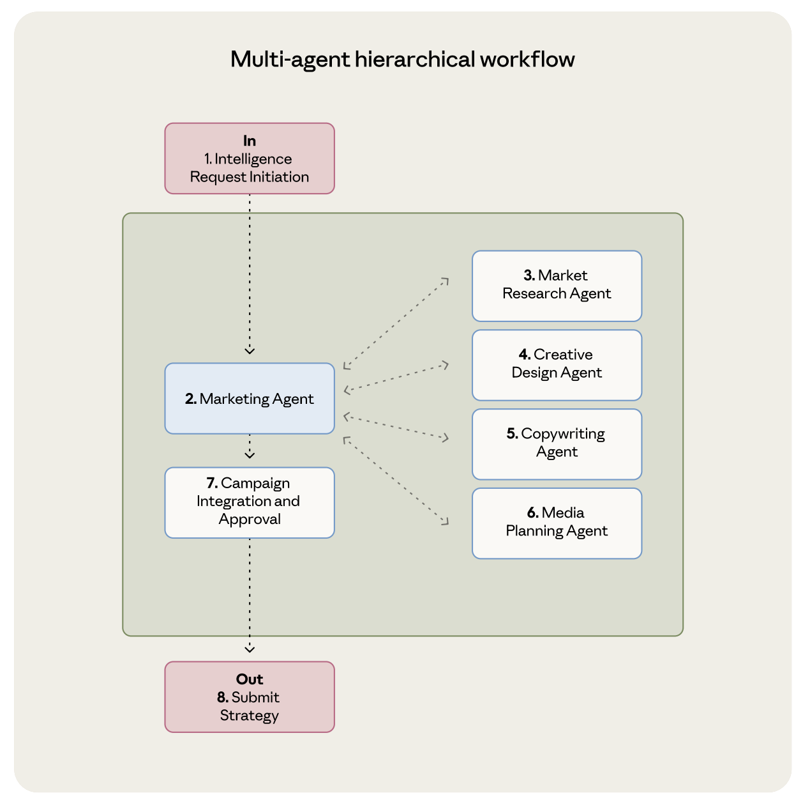
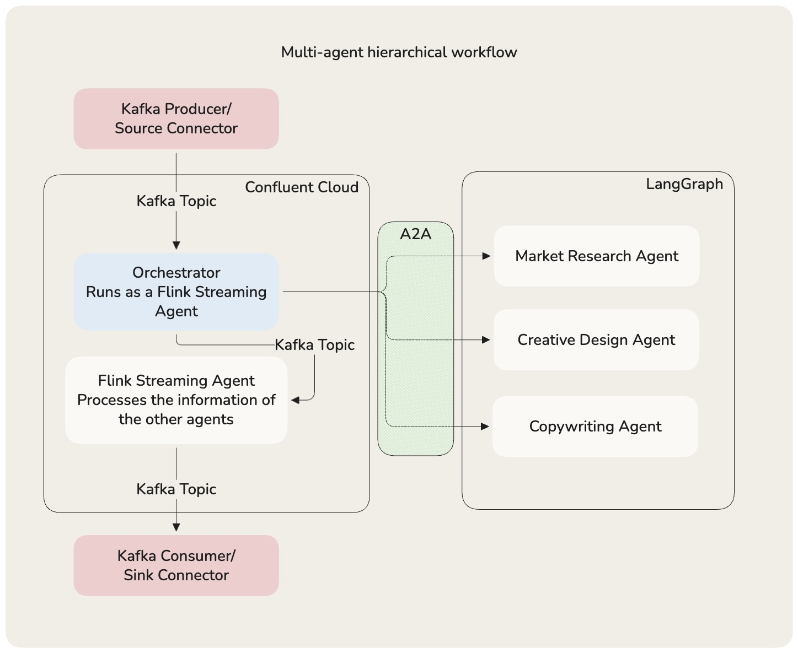

# Multi-Agent Hierarchical Workflow

Marketing campaign development using Confluent Streaming Agents and the A2A protocol, based on [Anthropic's architecture patterns](https://resources.anthropic.com/hubfs/Building%20Effective%20AI%20Agents-%20Architecture%20Patterns%20and%20Implementation%20Frameworks.pdf).

This implementation uses a Streaming Agent running on Confluent Cloud Flink as the orchestrator with local LangGraph agents exposed via A2A.

 

## Notes

- This demo lacks monitoring. It's hard to understand what goes wrong.
- The agents, instructions and goal are extremely simplified. Increasing the complexity leads to cascading timeout or retry errors. You can configure the agents, but for a simple demo that aims to demonstrate the architecture is more effort than I was willing to put.

## Prerequisites

- Python 3.12+ with [uv](https://docs.astral.sh/uv/)
- AWS credentials (Bedrock access)
- [ngrok](https://ngrok.com/) (3 tunnels for local agents)
- Confluent Cloud account

## What Gets Deployed

**Confluent Cloud:**

- Environment with Advanced Stream Governance
- Standard Kafka cluster + Schema Registry
- Flink compute pool (10 CFU)
- Bedrock connection + LLM model
- 3 A2A connections & tools
- Marketing orchestrator agent + finalizer agent
- CTAS pipelines: `marketing_event` → `marketing_event_agent_responses` → `finalizer_agent_responses`
- RTCE-enabled topic for real-time queries (future enhancement, no use today)

**Local:**

- 3 LangGraph agents exposed via A2A protocol; all use a Bedrock hosted LLM

## Setup

### 1. Start ngrok tunnels

```bash
ngrok http 10001  # market_research
ngrok http 10002  # creative_design
ngrok http 10003  # copywriting
```

### 2. Configure local agents

```bash
cp agents/.env.example agents/.env
# Add AWS credentials and ngrok URLs to .env
```

### 3. Run local agents

```bash
cd agents && uv run app --agent all
```

### 4. Configure infrastructure

Enter the ngrok URLs to the corresponding variables in `terraform.tfvars`.

The mapping of the ports to the corresponding agent matters.

```
10001 -> market research
10002 -> creative design
10003 -> copywriting
```

```bash
cd infrastructure
cp terraform.tfvars.example terraform.tfvars
# Add credentials and ngrok URLs to terraform.tfvars
```

### 5. Deploy infrastructure

```bash
cd infrastructure
terraform apply
```

### 6. Configure & run the local producer

```shell
cd infrastructure
terraform output -raw producer_properties > ../producer/producer.properties

cd ../producer
uv run producer.py
```

### See the results

Now check the topics on CC and see the output of the agents.

The `marketing_event_agent_responses` topic contains the  responses of the orchestrator.

The `finalizer_agent_responses` topic contains the _beautified_/enhaned responses of the multi-agent workflow.


## Troubleshooting

Verify agent is running:

```bash
curl -s http://localhost:10001/.well-known/agent-card.json | python3 -m json.tool
```

Send a test request:

```bash
curl -s -X POST http://localhost:10001/ \
  -H "Content-Type: application/json" \
  -H "A2A-Version: 1.0" \
  -d '{
    "jsonrpc": "2.0",
    "id": 1,
    "method": "SendMessage",
    "params": {
      "message": {
        "messageId": "msg-1",
        "role": "ROLE_USER",
        "parts": [{"text": "What are the trends in the electric vehicle market?"}]
      }
    }
  }'
```

## Triggering the Pipeline

Produce a message to `marketing_event` topic to trigger the full workflow. Results flow through both agent tables.
